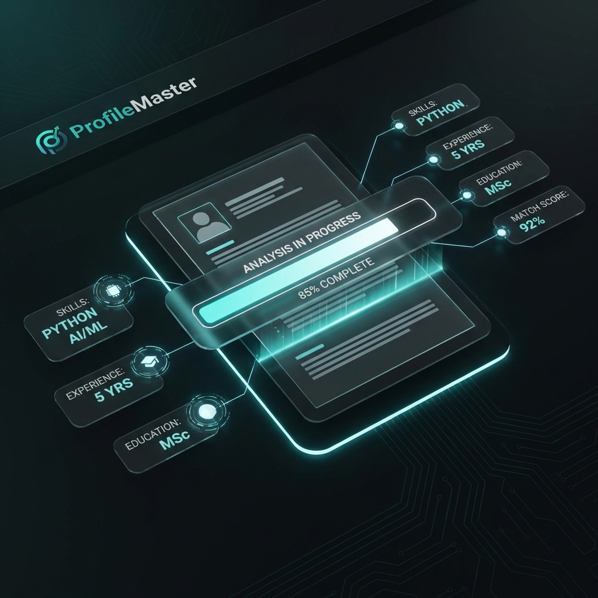

# Professional Portfolio | M Manoj Kumar

Welcome to my professional portfolio! I am an AI & ML Practitioner specializing in Generative AI, Large Language Models (LLMs), and building scalable, real-world intelligent systems.



## 🚀 About Me

I'm M Manoj Kumar, an Electronics and Communications Engineer by training and an AI architect by passion. I focus on bridging the gap between cutting-edge AI research and practical, user-centric engineering. My work involves designing autonomous agents, RAG-based systems, and immersive digital experiences.

---

## 🛠️ Technology Stack

### AI & Machine Learning

- **Frameworks:** LangChain, LangGraph, CrewAI, TensorFlow, PyTorch
- **Models:** OpenAI (GPT-4o), Google Gemini, Llama
- **Techniques:** Retrieval Augmented Generation (RAG), Fine-tuning, Agentic Workflows
- **Vector DBs:** Pinecone, Qdrant

### Full Stack Development

- **Frontend:** React, Next.js, HTML5, CSS3 (Modern Glassmorphism & Animations)
- **Backend:** Node.js, FastAPI, Python
- **Database:** PostgreSQL, Supabase, Firebase
- **Tools:** GitHub API, OCR Pipelines

---

## 🌟 Featured Projects

### [ExamAI](https://github.com/mallelamanojkumar90)

**AI-powered IIT-JEE prep platform**

- Implemented RAG with Pinecone and Gemini for precise academic support.
- Built a responsive frontend for interactive learning.

### [ProfileMaster](https://github.com/mallelamanojkumar90)

**AI-driven career optimization platform**

- Automated resume analysis and optimization using OpenAI.
- Integrated secure payment gateways and Firebase authentication.

### [DevPostAI](https://github.com/mallelamanojkumar90/DevPostAI)

**Technical Content Generation**

- Analyzes GitHub repositories in real-time to generate professional social media updates.
- Uses GitHub API and React 19 for a modern developer experience.

### [ArticleGen](https://github.com/mallelamanojkumar90/articelgen)

**Agentic AI Research Pipeline**

- Utilizes Multi-agent systems (CrewAI) for autonomous research and high-quality content drafting.

---

## 📈 Professional Experience

- **Freelance AI Software Engineer (2022 - Present):** Specialized in deploying AI applications, RAG systems, and FastAPI backends.
- **Junior Developer @ Pactera Edge (2021 - 2022):** Focused on enterprise application support (UPS BOSS) and received the Team Excellence award.

---

## 📬 Contact Details

- **Email:** [mallelamanoj75@gmail.com](mailto:mallelamanoj75@gmail.com)
- **LinkedIn:** [Manoj Kumar Mallela](https://www.linkedin.com/in/manojkumar-mallela-045157104)
- **GitHub:** [@mallelamanojkumar90](https://github.com/mallelamanojkumar90)
- **Twitter:** [@itsM_Manojkumar](https://twitter.com/itsM_Manojkumar)

---

## 🛠️ Local Development

To run this portfolio locally:

1. Clone the repository:
   ```bash
   git clone https://github.com/mallelamanojkumar90/Portfolio.git
   ```
2. Open `index.html` in your favorite browser.
   _(Or use a local server like Live Server in VS Code)_

---

&copy; 2026 M Manoj Kumar. Crafted with Intelligence.
